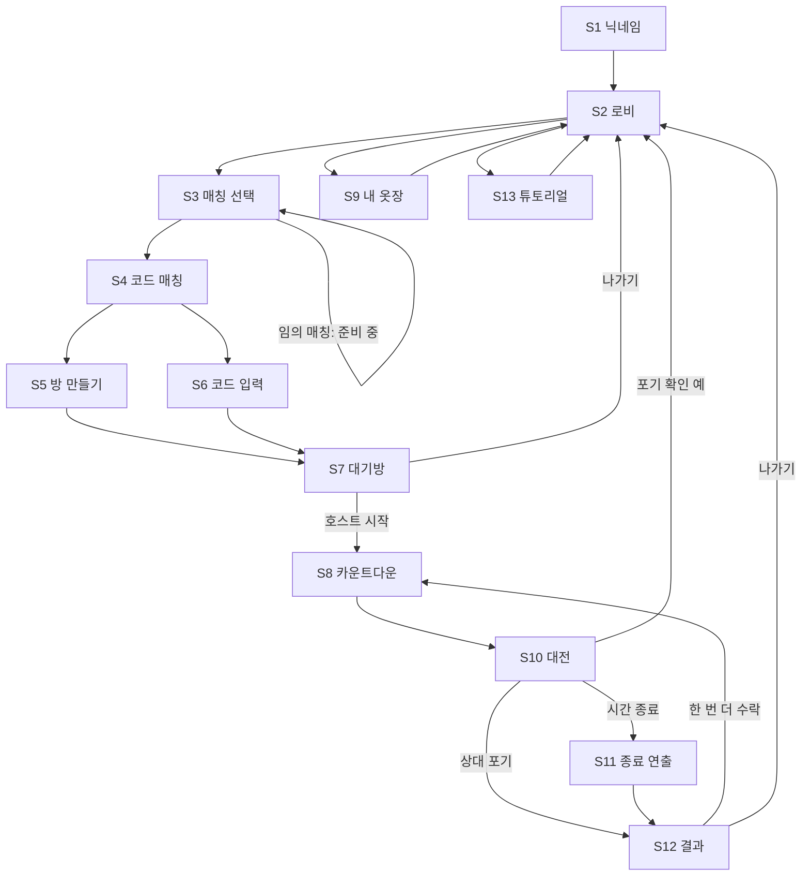

# 01. 사용자 흐름

## 1. 화면 목록

| ID | 화면 | 들어오는 곳 | 나가는 곳 | 단계 | 라벨 |
|---|---|---|---|---|---|
| S1 | 닉네임 입력(별도 화면 없이 로비의 내 옷장 칸 안에 있다) | 첫 접속 | S2 | P0 | 확정 |
| S2 | 로비: 게임 시작, 내 옷장(닉네임, 캐릭터), 튜토리얼 | 첫 접속, 결과, 포기 후 | S3, S9, S13 | P0 | 확정 |
| S3 | 매칭 선택: 임의 매칭, 코드 매칭 | S2 | S4, S2 | P0 | 확정 |
| S4 | 코드 매칭: 방 만들기, 코드 입력하기 | S3 | S5, S6 | P0 | 확정 |
| S5 | 방 만들기(방 제목, 난이도, 맵, 제한시간, 프롬프트 제한) | S4 | S7 | P0 | 확정 |
| S6 | 코드 입력 | S4 | S7 | P0 | 확정 |
| S7 | 대기방(코드와 복사, 설정, 준비, 시작) | S5, S6 | S8, S2 | P0 | 확정 |
| S8 | 카운트다운 3-2-1 | S7, 한 번 더 | S10 | P0 | 확정 |
| S9 | 내 옷장 | S2 | S2 | P1 | 확정 |
| S10 | 대전 | S8 | S11, S12 | P0 | 확정 |
| S11 | 종료 연출 | S10 | S12 | P0 | 확정 |
| S12 | 결과(나가기, 한 번 더 하기) | S11 | S2, S8 | P0 | 확정 |
| S13 | 튜토리얼(솔로) | S2 | S2 | P1 | 확정 |
| M1 | 포기 확인 모달 | S10 | S2 | P0 | 확정 |
| M2 | 한 번 더 요청 모달 | S12 | S8, S12 | P1 | 제안 |

- 닉네임은 로비에서 정하고 브라우저에 저장한다. `playerId`는 브라우저가 만들어 탭마다 따로 저장한다(sessionStorage). 같은 브라우저에서 탭 두 개로 대결을 시험할 수 있고, 새로고침해도 같은 사람으로 돌아온다. 탭을 닫으면 다른 사람이 된다. [제안]
- 방 만들기에서 방 제목은 설정 전에 입력하고 대기방 상단에 표시만 한다. 입장은 코드로만 한다. [제안]
- 임의 매칭 버튼은 있지만 누르면 "준비 중이에요" 안내만 뜨고 S3에 머문다. [제안]

## 2. 전체 이동 흐름

## 3. 주요 흐름

### 3.1 방 만들기와 입장 [확정]
1. 호스트가 S5에서 설정을 정하고 방 생성을 누른다. 서버가 6자리 코드를 만들어 돌려준다.
2. S7에서 코드를 복사 버튼으로 복사해 친구에게 보낸다.
3. 게스트가 S6에서 코드를 입력한다. 서버는 코드로 방을 찾고, 없거나 가득 찼거나 이미 시작했으면 오류 코드를 돌려준다(04 문서).
4. 게스트가 준비를 누르고 호스트가 시작을 누르면 S8로 간다. 호스트만 설정을 바꿀 수 있다. [제안]

### 3.2 포기 [확정]
1. S10에서 나가기를 누르면 "정말 게임을 포기하실건가요?"와 예/아니오 모달이 뜬다.
2. 아니오: 게임이 계속된다. 모달이 떠 있는 동안에도 타이머와 상대 진행은 멈추지 않는다. [제안]
3. 예: 포기한 쪽은 패배로 로비로 가고, 상대는 즉시 승리 처리되어 S12에 "상대가 포기했어요"가 뜬다. 3-2-1 카운트다운 중에 나가면 판이 무효다.
4. 재화와 참가비 정산은 이후 단계다(05 문서).

### 3.3 한 번 더 하기 [확정]
1. 결과 화면에서 한쪽이 한 번 더 하기를 누르면 상대에게 요청 모달이 간다.
2. 상대가 수락하면 같은 방 코드와 설정으로 S8부터 다시 시작한다. 거절하거나 10초 안에 응답이 없으면 요청이 취소된다.
3. 점수와 연속 카운트는 초기화되고, 이미 나온 문제는 이어받아 겹치지 않게 한다.

### 3.4 재접속 [제안]
- 대전 중 연결이 끊기면 20초 안에 같은 `playerId`로 다시 접속해야 한다. 서버가 스냅샷을 보내서 같은 화면으로 돌아온다. 20초를 넘기면 부전패다(02, 04 문서).
- 대기방에서는 60초까지 기다린다.

### 3.5 튜토리얼 [제안]
- S2의 연습하기로 들어간다. 서버 연결 없이 로컬 어댑터로 돌고, 문제 하나와 미리 준비한 AI 답변 2개(첫 전송은 RETRY, 두 번째는 PASS)를 쓴다. 단계는 03 문서 7절에 있다.
