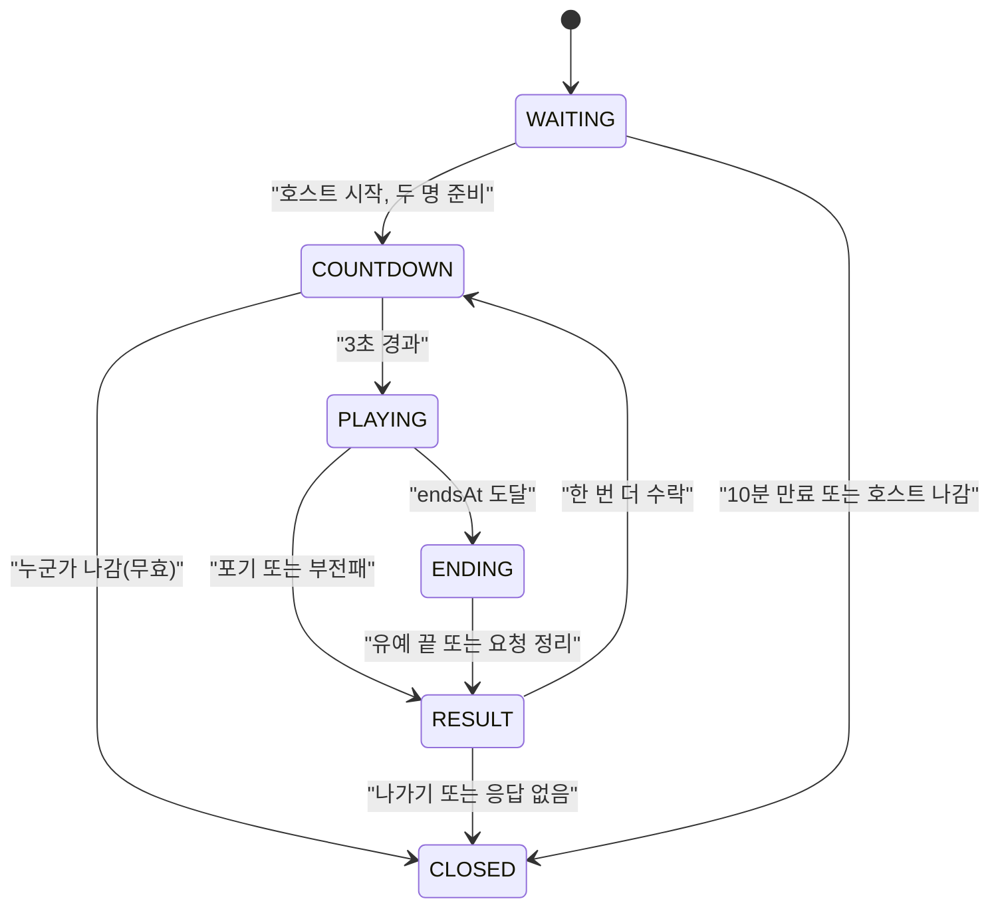
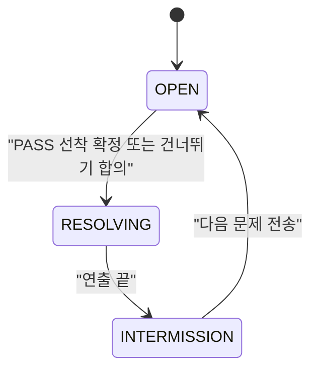

# 02. 게임 규칙

## 1. 한 판의 진행

1. 호스트가 방 설정을 정한다: 난이도(쉬움, 보통, 어려움), 제한시간(2, 3, 5분), 프롬프트 제한(50, 100, 150, 300, 무제한), 맵(동양풍만). [확정]
2. 호스트가 시작하면 3초 카운트다운 뒤 판이 시작된다. [제안]
3. 판이 시작되면 서버가 `endsAt = 시작 시각 + 제한시간`을 정한다. 이 값이 두 사람 모두의 종료 시각이다. [확정]
4. 서버는 방 설정의 난이도로 문제 목록 40개를 미리 뽑아 두고, 현재 문제만 두 사람에게 같은 시각에 보낸다. 목록은 `drawQuestion`의 안 나온 문제 우선 규칙을 쓰고, 난이도당 20개를 다 쓰면 같은 풀에서 다시 뽑는다(코드 확인). [제안]
5. 문제마다 주제문, 분량, 필수어 3개가 보인다. 유저는 주제어와 필수어를 말하지 않고 AI가 그 내용을 설명하게 프롬프트를 쓴다. [확정]
6. 유저가 전송하면 서버가 금지어, 길이, 빈 입력을 다시 검사하고 통과하면 Gemini에 프롬프트를 그대로 보낸다. [확정]
7. AI 답변이 오면 서버가 `checkAnswer`로 판정한다. 필수어 개수가 난이도 기준 이상이고 분량 이내면 PASS, 아니면 RETRY다. 주제 적합성은 평가하지 않는다. [확정]
8. 같은 문제를 두 사람이 동시에 풀기 때문에 먼저 PASS가 확정된 쪽이 점수 1을 얻고, 두 사람 모두 다음 문제로 간다. [확정]
9. `endsAt`에 도달하면 판이 끝난다. [확정]

## 2. 상태 흐름

방 상태:

문제 단계(PLAYING 안에서):

플레이어 상태(문제 단계가 OPEN일 때): `IDLE`(입력 가능), `WAITING_AI`(전송 후 답변 대기), `REVEALING`(답변 재생과 평가 연출), `LOCKED`(페널티). 연결이 끊기면 `DISCONNECTED`가 겹친다. [확정]

## 3. 한 문제 안에서의 규칙

### 3.1 전송과 RETRY
- 전송은 한 번에 한 건만 처리한다. AI 답변이 올 때까지 같은 문제에 두 번째 전송은 거절한다(`BUSY`). [제안]
- RETRY는 AI 답변이 조건을 만족하지 않은 경우다. 같은 문제에 다시 프롬프트를 쓸 수 있고 횟수 제한은 없다. [확정]
- 금지어, 길이 초과, 빈 입력으로 막힌 것은 전송이 아니다. 시도로 세지 않고, Gemini 호출도 없다. [확정]
- AI 오류로 자동 재시도한 것은 시도로 세지 않는다. [제안]
- RETRY 연출 동안 입력창에 글은 쓸 수 있지만 전송 버튼은 연출이 끝나야 켜진다. [제안]

### 3.2 선착 판정(레이스)
- 선착은 서버가 AI 답변을 받아 판정을 확정한 시각이 빠른 쪽이다. 연출 때문에 결과가 늦게 보이는 것은 순서에 영향이 없다. [제안]
- 한쪽의 PASS가 확정되면 다른 쪽에서 처리 중이던 요청은 취소하고(Gemini 호출도 중단), 그쪽 화면에 "상대가 먼저 맞혔어요"를 띄운다. 쓰던 글은 비운다. [제안]
- 두 PASS가 거의 동시에 확정되면 서버가 먼저 처리한 쪽만 점수를 얻는다. [제안]
- 선착한 쪽의 연출(답변 재생, 평가 읽기, PASS 화면)이 끝날 때까지 두 사람 입력이 잠긴다. 상대도 같은 연출을 같이 본다. [제안]

### 3.3 전환
1. 연출이 끝나면 점수 변화와 결과를 1초 보여 준다(`RESULT_HOLD_MS`).
2. 서버가 다음 문제를 두 사람에게 같은 시각에 보낸다. 전환 시간도 타이머에서 빼지 않는다. [확정]

### 3.4 건너뛰기
- 두 사람이 모두 건너뛰기를 눌렀을 때만 점수 없이 다음 문제로 넘어간다. 한 명이 누르면 상대에게 "상대가 건너뛰기를 원해요"가 보이고, 합의 전에는 취소할 수 있다. [확정]
- 건너뛰기가 적용되면 두 사람의 연속 카운트가 0이 된다. 그 문제는 이미 나온 것으로 친다. [제안]
- 건너뛰기에는 페널티가 없다. [확정]

## 4. 연속 PASS와 페널티

- 연속 카운트는 그 문제에서 첫 번째 시도로 선착 PASS했을 때만 1 올라간다. [확정]
- 카운트가 변하는 경우는 다음과 같다. 각 행의 라벨은 표에 있다.

| 상황 | 카운트 | 점수 | 라벨 |
|---|---|---|---|
| 첫 시도 선착 PASS | +1 | +1 | 확정 |
| RETRY가 한 번이라도 뜬 뒤 PASS | 0으로 | +1 | 제안 |
| 상대가 선착 PASS | 0으로 | 0 | 확정 |
| 건너뛰기 적용 | 두 사람 모두 0 | 0 | 제안 |

- 카운트가 3이 되면 상대에게 페널티를 걸고 내 카운트는 0으로 돌아간다. 그래서 6연속이면 한 번 더 걸린다. [제안]
- 페널티는 입력을 5초 동안 잠그는 것이다. [확정]
- 잠금은 다음 문제가 열리는 순간 시작한다. 전환 중의 잠금과 겹쳐 낭비되지 않게 하기 위해서다. [제안]
- 잠긴 동안 입력창만 막는다. 타이머, AI 답변 표시, 상대 상태 표시는 계속되고 쓰던 글은 유지된다. 이미 전송한 요청은 정상 처리된다. [제안]
- 잠금 중에 또 페널티가 걸려도 시간을 더하지 않는다. [제안]
- 판이 끝나기 전에 시작하지 못한 페널티는 사라진다. [제안]

## 5. 타이머와 종료

- 시간은 서버가 `endsAt`로 정하고 클라이언트는 표시만 한다. 시간바와 10초 전부터의 10-9-8 카운트다운도 서버 시각 기준으로 계산한다. [확정]
- AI 대기 시간은 타이머에서 빼지 않는다. 두 사람의 판은 같은 시각에 끝난다. [확정]
- `endsAt` 이후에는 새 전송을 받지 않는다. [확정]
- `endsAt` 전에 이미 전송한 요청은 최대 8초(`END_GRACE_MS`)까지 결과를 기다린다. 이 안에 PASS가 확정되면 점수에 반영되고, 그 뒤에 도착한 판정은 무효다. [확정]
- 유예 중에 새 문제는 나오지 않는다. [제안]
- 유예가 끝나거나 대기 중인 요청이 없어지면 종료 연출로 간다.

## 6. 숫자 상수

모두 `src/shared/constants.js`에 두고 UI와 서버가 같이 쓴다. [제안]

| 상수 | 값 | 라벨 |
|---|---|---|
| 제한시간 선택지 | 120, 180, 300초 | 확정 |
| 프롬프트 제한 선택지 | 50, 100, 150, 300, 무제한(null) | 확정 |
| 필수어 필요 개수 | 쉬움 1, 보통 2, 어려움 3 | 확정 |
| 연속 PASS 페널티 기준(`STREAK_TRIGGER`) | 3 | 확정 |
| 페널티 입력 정지(`PENALTY_MS`) | 5000 | 확정 |
| 마지막 카운트다운 시작 | 10초 전 | 확정 |
| 시작 카운트다운(`COUNTDOWN_SEC`) | 3초 | 확정 |
| 방 코드 자릿수 | 6, 영문 대문자와 숫자 중 헷갈리는 0 O 1 I 제외 | 제안 |
| 대기방 만료(`ROOM_WAIT_TTL_MS`) | 600000 | 제안 |
| 재접속 허용(`RECONNECT_GRACE_MS`) | 20000 | 제안 |
| 대기방 재접속 허용 | 60000 | 제안 |
| 종료 유예(`END_GRACE_MS`) | 8000 | 확정 |
| AI 응답 한도(`AI_TIMEOUT_MS`) | 8000 | 제안 |
| AI 자동 재시도(`AI_RETRY_MAX`) | 2회 | 제안 |
| 답변 재생 최소 속도 | 초당 40자 | 제안 |
| 답변 재생 최대 시간(`TYPE_REPLAY_MAX_MS`) | 2500 | 제안 |
| 평가 읽기 연출(`READ_MS`) | 100자 이하 1500, 200자 이하 2250, 그 이상 3000 | 제안 |
| 결과 표시(`RESULT_HOLD_MS`) | 1000 | 제안 |
| 문제 목록 길이(`SEQUENCE_LENGTH`) | 40 | 제안 |
| 한 번 더 요청 유효(`REMATCH_TTL_MS`) | 10000 | 제안 |
| 이모지 쿨다운 / 표시 | 2000 / 2000 | 제안 |
| 전송 최소 간격 | 1000 | 제안 |
| 프롬프트 절대 상한(무제한일 때만) | 2000자 | 제안 |
| 방 제목 / 닉네임 길이 | 2~20자 / 2~8자 | 제안 |

- 답변 재생 속도는 `max(40, 글자수 / 2.5초)`다. 300자면 초당 120자다. 레이스에서 한 문제당 두 사람이 잠기는 연출 시간을 최대 약 5.5초(`2.5 + 3`)로 묶기 위한 값이다. [제안]
- "무제한" 프롬프트도 서버는 2000자까지만 받는다. `promptRules.js`의 `checkPrompt`는 null을 진짜 무제한으로 다루므로, 서버가 `limit ?? 2000`으로 넘겨야 한다. [제안]

## 7. 승패와 점수

- 점수는 PASS한 문제 수다. [확정]
- 점수가 높은 쪽이 승리, 같으면 무승부다. 0 대 0도 무승부다. 연장전은 없다. [확정]
- 포기: 포기한 쪽이 패배, 상대는 즉시 승리한다. 점수는 그 시점 값을 유지한다. [확정]
- 부전패: 재접속 허용 시간을 넘긴 쪽이 패배한다. 포기와 달리 참가비를 걷지 않는다. [제안]
- 3-2-1 카운트다운 중에 누가 나가면 판이 무효다. [확정]
- 결과 화면은 총 플레이 시간, 점수, 승패를 보여 준다. 시간 종료일 땐 제한시간과 같고, 포기나 부전패일 땐 실제 경과 시간이다. [제안]
- 결과 화면에서 두 사람의 프롬프트와 AI 답변을 문제별로 공개한다. [제안]
- 재화, 랭크, 참가비 정산은 이후 단계다(05 문서). [확정]

## 8. 예외 상황

| 상황 | 처리 | 라벨 |
|---|---|---|
| 클라이언트 검사를 우회해 금지어를 보냄 | 서버가 `checkPrompt`로 다시 막고 `prompt:rejected`(`FORBIDDEN`)를 돌려준다. Gemini 호출 없음 | 확정 |
| 프롬프트가 제한을 넘음 | 서버 설정값을 기준으로 `TOO_LONG` 거절. 클라이언트가 보낸 제한값은 무시 | 확정 |
| 페널티 중에 전송 | `LOCKED` 거절 | 제안 |
| 이미 끝난 문제 번호로 전송 | `STALE` 거절 | 제안 |
| AI 답변이 비어 옴(안전 필터 등) | 같은 프롬프트로 최대 2회 자동 재시도. 시도로 세지 않음. 타이머는 멈추지 않음 | 제안 |
| AI 오류나 시간 초과가 계속됨 | 그 전송을 무효 처리하고 `attempt:void`로 알린다. 시도와 연속 카운트에 영향 없이 다시 쓸 수 있다 | 제안 |
| 답변이 토큰 한도로 잘림 | 분량 초과로 보아 RETRY | 제안 |
| 필수어는 있지만 분량 초과 | RETRY. 연출에서 분량 초과를 보여 준다 | 확정 |
| 연결이 끊김 | 20초 안에 복귀하면 스냅샷으로 복원. 그동안 타이머는 계속 흐르고 상대 화면에 끊김 표시 | 제안 |
| 끊긴 사이 그 사람 요청이 PASS로 확정됨 | 점수에 정상 반영하고 복귀 시 스냅샷으로 알림 | 제안 |
| 둘 다 끊김 | 둘 다 20초 안에 못 돌아오면 판 무효 | 제안 |
| 호스트가 대기방을 나감 | 방이 닫힌다 | 제안 |
| 없는 코드, 가득 찬 방, 이미 시작한 방 | 각각 `ROOM_NOT_FOUND`, `ROOM_FULL`, `ROOM_STARTED` | 확정 |
| 같은 `playerId`로 두 번째 접속 | 새 접속이 기존 접속을 대체한다 | 제안 |
| 문제 풀이 소진 | 같은 난이도 풀에서 다시 섞어 이어 붙인다 | 확정 |
| 건너뛰기를 한 사람이 끊김 | 끊긴 사람의 건너뛰기 표시는 유지, 20초 뒤 부전패가 우선 | 제안 |
| 한 번 더 요청 중 상대가 나감 | 요청을 취소하고 방을 닫는다 | 제안 |
| 서버가 다시 켜짐 | 모든 방이 사라지고 클라이언트는 로비로 돌아간다 | 제안 |
| 시작 전에 설정 바꿈 | 호스트만 가능. 게스트 준비는 설정이 바뀌면 해제 | 제안 |

## 9. 열려 있는 확인 사항

- AI 재시도 대기 시간을 타이머에서 뺀다는 이전 제안은 "빼지 않는다, 같은 시각에 끝난다"는 확정과 맞지 않아 폐기했다. 불이익 없는 재시도(시도 미집계)만 남겼다. 08 문서 충돌 기록에 있다. [확정]
- 연출 때문에 문제당 잠기는 시간이 길 수 있다. 시연 중 체감을 보고 `TYPE_REPLAY_MAX_MS`와 `READ_MS`를 줄일 수 있다. [제안]
