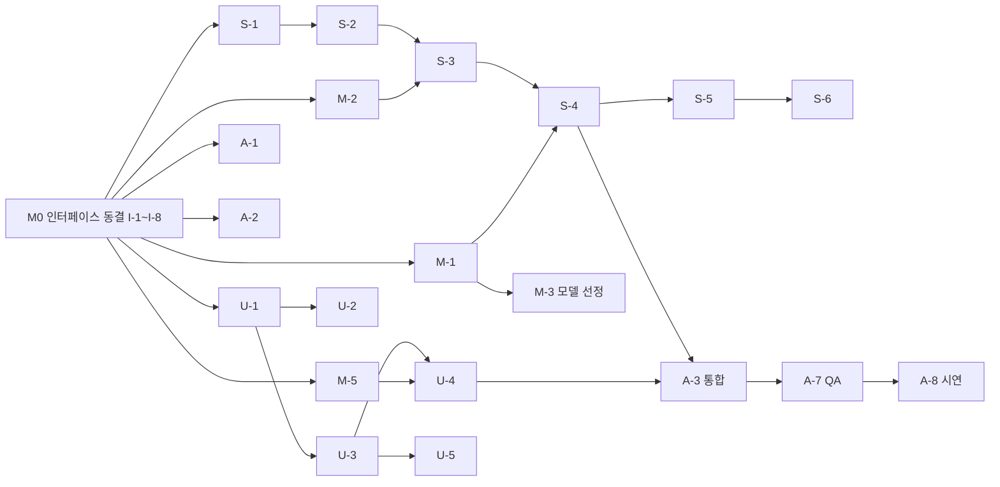

# 07. 작업 계획

마감은 2026-10-03 09:00이다(시간대는 한국 시간 가정). 기능 동결은 마감 2시간 전이고, 마감 1시간 전에는 시연 가능한 상태여야 한다. 아래 시간표는 착수 시각을 K로 둔 기본값이며, 남은 시간이 모자라면 5절의 자르는 순서를 따른다. [제안]

## 1. 먼저 합의할 인터페이스 (M0에서 동결)

서버, UI, 모델 전문이 서로 기다리지 않고 동시에 시작하려면 아래 8개를 먼저 정해야 한다. 이 문서와 04, 06 문서가 정본이고, 올라운더가 코드 골격(A-1, A-2)으로 옮긴다. [확정]

| ID | 인터페이스 | 정하는 내용 | 쓰는 사람 | 정본 |
|---|---|---|---|---|
| I-1 | 이벤트 명세 | 이벤트 이름, 데이터 형식, 오류 코드 | 서버, UI | 04 문서 |
| I-2 | 규칙 파일 API | `checkPrompt`, `checkAnswer`(+`opts.truncated`, `reasons`), `drawSequence`, `locateMatches` | 서버, UI, 모델 | 06 문서 3절 |
| I-3 | `GeminiClient` | `generate(prompt, {signal})`의 입출력 모양과 목(mock) 구현 | 서버, 모델 | 06 문서 5절 |
| I-4 | `GameTransport` | 클라이언트가 서버와 말하는 통로 | UI, 올라운더 | 아래 |
| I-5 | 데이터 모양 | `Problem`, `LengthRule`, `Settings`, `Verdict`, `PlayerPublic` | 모두 | 04 문서 2절 |
| I-6 | 상수 | `src/shared/constants.js` (02 문서 6절) | 모두 | 02 문서 6절 |
| I-7 | 폴더와 명령어 | 폴더 구조, `npm run dev`, `npm test`, `npm run build:problems`, 환경변수 `GEMINI_API_KEY`, `PORT`, `GEMINI_MODEL` | 모두 | 00 문서 8절 |
| I-8 | 시연 시나리오 데이터 | 04 문서 8절의 이벤트 순서를 JSON으로 만든 목 재생 파일 | UI, 서버 | A-2 |

I-4 `GameTransport` (스펙용 예시): [확정]

```js
transport.connect({ playerId, resumeToken })   // 연결과 hello
transport.send(type, payload)                  // 04 문서 3절
transport.on(type, handler); transport.off(type, handler)   // 04 문서 4절
transport.serverNow()                          // 서버 시각 보정값
// 구현 3개: WebSocketTransport(실전), MockTransport(UI 단독 개발), LocalTutorialTransport(튜토리얼)
```

동시에 시작하는 방법:

- 서버: `GeminiClient`의 목 구현과 가짜 클라이언트 스크립트로 UI 없이 한 판을 끝까지 돌려 본다.
- UI: `MockTransport`가 I-8 시나리오를 재생하므로 서버 없이 화면을 완성한다.
- 모델: 서버와 UI가 쓸 `fixtures/answers.json`(PASS, RETRY, 잘림, 빈 응답 예시)을 M0 직후 1시간 안에 먼저 내놓는다(M-5).
- 인터페이스를 바꾸려면 세 사람에게 알리고 04 문서를 먼저 고친다. 코드가 먼저 바뀌어서는 안 된다. [확정]

## 2. 역할별 작업

우선순위 P0는 데모 필수, P1은 첫 공개 나머지다. 시간은 대략적인 추정(시간 단위)이다. [제안]

### 2.1 서버 전문

| ID | 작업 | 우선 | 시간 | 의존 | 완료 기준 |
|---|---|---|---|---|---|
| S-1 | 서버 골격: `ws`, 정적 파일(`/`, `/shared`), `hello`/`pong`/`error`, `playerId`와 `resumeToken` 발급 | P0 | 1.5 | I-1, I-7 | 가짜 클라이언트 두 개가 접속해 `hello:ok`를 받는다 |
| S-2 | 방: 생성, 코드 입장(`joinRoomByCode` 단일 입구), 설정, 준비, 나가기, 10분 만료, 오류 코드 3종 | P0 | 2 | S-1 | `ROOM_NOT_FOUND`, `ROOM_FULL`, `ROOM_STARTED`가 재현된다. 호스트가 나가면 방이 닫힌다 |
| S-3 | 게임 상태기계: 카운트다운, `endsAt`, 문제 목록, `problem:new`, 종료 | P0 | 2 | S-2, I-2 | 3초 뒤 `game:begin`, `endsAt`에 `game:ended`가 온다. 두 클라이언트가 같은 문제를 받는다 |
| S-4 | 전송 파이프라인: 04 문서 10절 순서, `checkPrompt`, Gemini 호출, `checkAnswer`, `answer:ready`, `opponent:answer`, 점수와 연속 카운트 | P0 | 4 | S-3, I-3 | 한 판에서 RETRY와 PASS가 규칙대로 동작하고 PASS한 사람만 다음 문제로 넘어간다 |
| S-5 | 점수, 연속 카운트, 페널티(다음 문제 시작부터 5초), 시간 종료 즉시 종료 | P0 | 2 | S-4 | 02 문서 4, 5절 표의 모든 행이 시나리오 테스트로 통과한다 |
| S-6 | 포기, 부전패, 무효 판, `game:ended`와 `history` | P0 | 1.5 | S-5 | 포기 시 상대 승리, 카운트다운 중 나가기는 무효, 점수 동점은 무승부 |
| S-7 | 건너뛰기(규칙 재확정 후), 이모지, 한 번 더, 입력 중 상태 | P1 | 2.5 | S-5 | 건너뛰기는 새 규칙(02 문서 3.3)대로 동작한다. 한 번 더는 양쪽이 누를 때만 시작 |
| S-8 | 재접속 스냅샷, `conn:peer`, 20초 부전패 | P1 | 2 | S-5 | 새로고침 후 같은 화면 상태로 돌아온다. 20초 초과 시 부전패 |
| S-9 | 방어: 전송 최소 간격, 8KB, 초당 메시지 수, `Origin`, 로그에서 본문 제외 | P1 | 1 | S-4 | 05 문서 5절 표의 제안 항목이 시나리오 테스트로 확인된다 |
| S-10 | 서버 시나리오 테스트: 가짜 클라이언트 두 개로 한 판 | P0 | 1.5 | S-4 | `npm test`가 한 판 완주와 02 문서 8절 예외 일부를 확인한다 |

### 2.2 UI 전문

| ID | 작업 | 우선 | 시간 | 의존 | 완료 기준 |
|---|---|---|---|---|---|
| U-1 | 골격: 화면 이동, 상태 저장소, `GameTransport` 두 구현(웹소켓, 목), I-8 재생기 | P0 | 2 | I-1, I-4, I-8 | 서버 없이 목으로 S1부터 S12까지 이동한다 |
| U-2 | S1 닉네임, S2 로비, S3~S6, S7 대기방(코드 복사) | P0 | 3 | U-1 | 코드를 복사해 두 번째 탭에서 입장하는 흐름이 목으로 동작한다 |
| U-3 | S8 카운트다운, S10 대전 레이아웃(03 문서 3절), 입력창과 `checkPrompt`, 글자 수, 시간 바(10초 카운트), 점수와 연속 PASS 칸 | P0 | 4 | U-1, I-2 | 금지어는 막히고 어떤 단어인지 보인다. 시간 바가 서버 시각으로 줄어든다 |
| U-4 | 설명창 연출: 답변 재생, 평가 읽기 하이라이트, PASS 검은 화면, RETRY 블루스크린, 이유 한 줄, 상대 설명창, "상대가 먼저" 안내 | P0 | 4 | U-3, M-5 | `answer:ready` 목 입력으로 `verdict`와 다른 연출이 나오는 일이 없다 |
| U-5 | 페널티 표시, 포기 모달, S11 종료 연출, S12 결과(프롬프트 공개 포함) | P0 | 3 | U-3 | 페널티 5초 카운트, 포기 확인, 승, 패, 무승부 화면이 보인다 |
| U-6 | S9 옷장, 캐릭터 4종 자체 제작과 반응, 이모지, 건너뛰기 버튼, 한 번 더 모달, 끊김 표시와 자동 재접속 | P1 | 4 | U-5 | 4종 캐릭터가 선택과 반응을 한다. 기존 게임의 에셋은 쓰지 않는다 |
| U-7 | 동양풍 배경(CSS, SVG) | P1 | 1.5 | U-3 | 대전 화면이 동양풍 배경으로 보인다 |
| U-8 | 하이라이트 오버레이 컴포넌트(튜토리얼에서 사용) | P1 | 1.5 | U-3 | 요소를 지정하면 그 부분만 밝아지고 안내 문구가 붙는다 |

### 2.3 모델 전문

이미 구현된 것: `checkPrompt`, `checkAnswer`, `drawQuestion`, 금지어 우회 처리, 문제 60개와 분량 8개, 엑셀 변환 스크립트, 테스트 10개(전부 통과). 아래는 남은 일만이다. [확정]

| ID | 작업 | 우선 | 시간 | 의존 | 완료 기준 |
|---|---|---|---|---|---|
| M-5 | `fixtures/answers.json`: PASS, RETRY(필수어 부족, 분량 초과), 잘림, 빈 응답 예시와 각각의 기대 `verdict` | P0 | 0.5 | I-2 | 서버와 UI가 목 테스트에 바로 쓴다. 기대값은 `checkAnswer` 실행 결과와 일치 |
| M-1 | `GeminiClient` 실구현과 목 구현: 시스템 프롬프트 없이 호출, 생각 끄기, 최대 출력 토큰, `AbortSignal`, 상태 분류(OK, EMPTY, BLOCKED, ERROR), 종료 사유로 `truncated` | P0 | 3 | I-3 | 실제 키로 10번 호출해 분류가 맞고, 목은 스크립트대로 응답한다. 키가 없으면 서버 시작 시 분명한 오류 |
| M-2 | 규칙 파일 추가: `opts.truncated`, `reasons`, `drawSequence`(시드 가능), `locateMatches` | P0 (`locateMatches`만 P1) | 2 | I-2 | 기존 테스트 10개가 그대로 통과하고 새 동작 테스트가 붙는다 |
| M-3 | 모델 선정 실험: 후보 2~3개로 좋은 프롬프트와 나쁜 프롬프트 각 10개를 보내 PASS 비율, 평균 토큰, 지연 시간을 측정. 생각 끄는 설정과 최대 토큰 1024가 맞는지 확인 | P0 | 2 | M-1 | 06 문서 5절 모델 칸과 7절 비용 칸의 미정을 값으로 채운다. 한도(분당 요청 수)도 기록 |
| M-4 | 데이터 정리: 빌드 스크립트에 "필수어 정확히 3개" 검사 추가, 옛 파이썬 스크립트 삭제, 문제 표본 점검(필수어가 AI 답변에 잘 나오는지, 영어 번역어 보강) | P1 | 2 | | 빌드가 오류를 제대로 잡고 `problems.json`이 xlsx와 일치한다 |
| M-6 | 튜토리얼용 문제 1개와 가짜 AI 답변 2개(첫 전송 RETRY, 두 번째 PASS) | P1 | 0.5 | M-2 | 실제 `checkAnswer`에서 정확히 RETRY와 PASS가 나온다 |

### 2.4 올라운더

올라운더는 세 전문가가 서로 맞물리는 틈을 메운다. 틈은 크게 네 곳이다. 하나는 폴더 구조와 상수처럼 아무도 주인이 아닌 공유 코드, 둘째는 서버와 UI가 만나는 이음매(이벤트 형식 불일치), 셋째는 튜토리얼처럼 두 영역에 걸친 기능, 넷째는 시연과 QA이다. [확정]

| ID | 작업 | 우선 | 시간 | 의존 | 완료 기준 |
|---|---|---|---|---|---|
| A-1 | 폴더 정리: 파일 이동(00 문서 8절), 테스트 경로 수정, `package.json`(`type: module`, 명령어), `.gitignore`, `.env.example`, `constants.js` | P0 | 1 | I-6, I-7 | 이동 후 `npm test`가 기존 10개 모두 통과. 다른 세 사람이 같은 구조에서 시작 |
| A-2 | 인터페이스 코드화: `src/shared/protocol.js`(이벤트 이름 상수, 데이터 검증, 오류 코드)와 I-8 시나리오 JSON | P0 | 2 | I-1 | 서버와 UI가 같은 파일을 가져다 쓴다. 잘못된 메시지는 검증이 잡는다 |
| A-3 | 통합 책임: 서버와 UI를 실제로 연결해 두 브라우저 탭에서 한 판 완주. 이벤트 불일치는 04 문서를 고치고 알린 뒤 해결 | P0 | 4 | S-4, U-4 | M2 시나리오가 통과한다 |
| A-4 | 튜토리얼: `LocalTutorialTransport`와 4단계 스크립트(03 문서 7절), 연습하기 진입 | P1 | 3 | M-6, U-8 | 서버 연결 없이 RETRY, PASS를 거쳐 끝난다. 실전과 같은 화면과 `promptRules.js`를 쓴다 |
| A-5 | 임의 매칭 버튼 안내("준비 중이에요"), 서버 입장 입구(`joinRoomByCode`)가 단일한지 리뷰 | P1 | 0.5 | S-2 | 버튼은 있고 동작은 없다. 입장 로직은 코드 입장 한 곳뿐이다 |
| A-6 | 닉네임 금칙어 목록 초안, 이모지 목록, 오류 문구 한글 모음 | P1 | 1 | | 닉네임 필터가 동작하고 문구가 한곳에 모여 있다 |
| A-7 | QA: 02 문서 8절 예외 표를 체크리스트로 만들어 실제로 돌려 본다 | P0 | 2 | A-3 | 확인 못 한 예외는 08 문서에 남긴다 |
| A-8 | 시연 준비: 실행법 README, 배포 또는 터널 확인, 시연 시나리오(두 탭), 백업 영상, 리허설 2회 | P0 | 2 | A-3 | 새 컴퓨터에서 README만 보고 서버가 뜬다. 시연 대본이 있다 |
| A-9 | 문서 동기화: 결정이 바뀌면 08 문서의 결정 기록과 라벨을 갱신 | 상시 | | | 문서와 코드가 어긋난 채 마감하지 않는다 |

## 3. 의존 관계



- 서버가 `GeminiClient`를 기다리지 않도록 S-4는 목 구현으로 먼저 개발한다. 실구현은 M-1이 끝나면 바꿔 끼운다. [확정]
- 모델 선정(M-3)이 늦어지면 임시 기본 모델로 시연을 진행하고, 결과가 나오면 환경변수만 바꾼다. [제안]

## 4. 마일스톤

| 마일스톤 | 시점 | 달성 기준 | 라벨 |
|---|---|---|---|
| M0 인터페이스 동결 | K+1시간 | I-1~I-8 합의, 04, 06 문서 리뷰 완료, A-1 폴더 정리 끝 | 제안 |
| M1 단독 동작 | K+4시간 | 서버는 가짜 클라이언트로 한 판, UI는 목으로 한 판, 모델은 `GeminiClient` 실호출과 M-5 | 제안 |
| M2 P0 통합 | K+8시간 | 두 브라우저 탭에서 코드 방 생성, 입장, 한 판, RETRY, PASS, 페널티 1회, 결과까지 완주(A-3) | 제안 |
| M3 P1 확장 | K+12시간 | 5절 순서대로 가능한 만큼 | 제안 |
| 기능 동결 | 마감 2시간 전 | 새 기능 금지, 버그 수정과 시연 준비만 | 확정 |
| 리허설 | 마감 2시간 전~1시간 전 | 시연 시나리오 2회 연속 성공 | 제안 |
| 제출 가능 상태 | 마감 1시간 전 | README, 실행 환경, 백업 영상 준비 완료 | 제안 |

## 5. 시간이 모자랄 때 자르는 순서

앞에 있는 것부터 먼저 자른다. P0는 자르지 않는다. [제안]

1. 한 번 더 하기(S-7 일부, U-6 일부)
2. 튜토리얼(A-4, U-8, M-6). 시간이 되면 설명 글만 있는 한 화면으로 대체한다
3. 재접속(S-8). 새로고침하면 방에서 빠지는 것으로 둔다
4. 건너뛰기(S-7 일부)
5. 옷장(캐릭터 4종 중 기본 하나만 고정, U-6 일부)
6. 이모지
7. 평가 읽기 하이라이트의 세부(필수어 강조와 분량 초과 표시는 이미 구현되어 있으니 문장 이동만 남긴다)

- 자르지 않는 연출: 답변 재생과 PASS 검은 화면, RETRY 블루스크린. 판정과 연출이 어긋나지 않게 하는 것은 이 게임의 핵심이기 때문이다. [확정]

## 6. 데모 완료 기준 (P0) [제안]

두 브라우저 탭에서 닉네임을 정하고 코드로 방에 들어가 3분 판을 하고, 한 판 안에서 RETRY와 PASS와 3연속 페널티가 한 번씩 나오며, 결과 화면에 승패가 뜬다. 중간에 포기를 눌러도 정상 종료된다.
